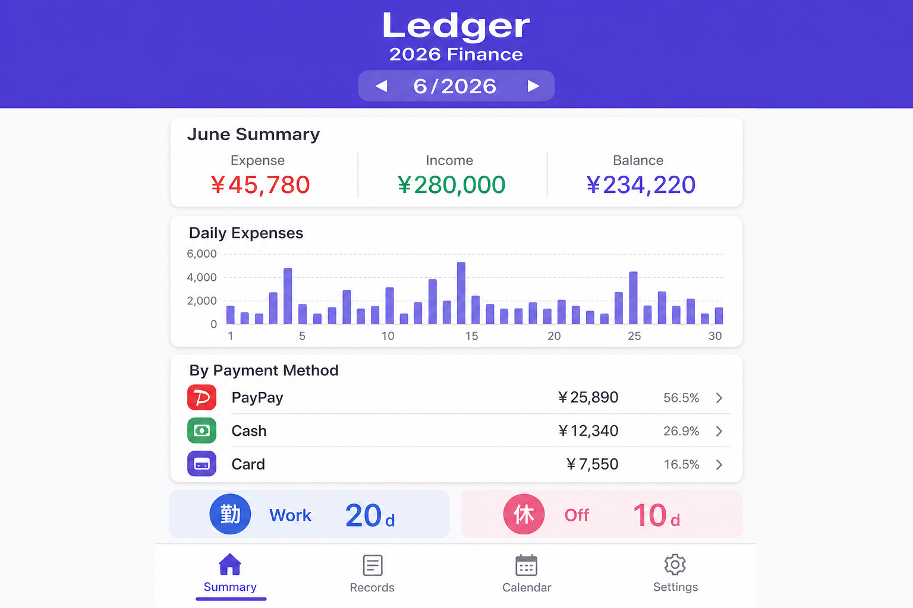
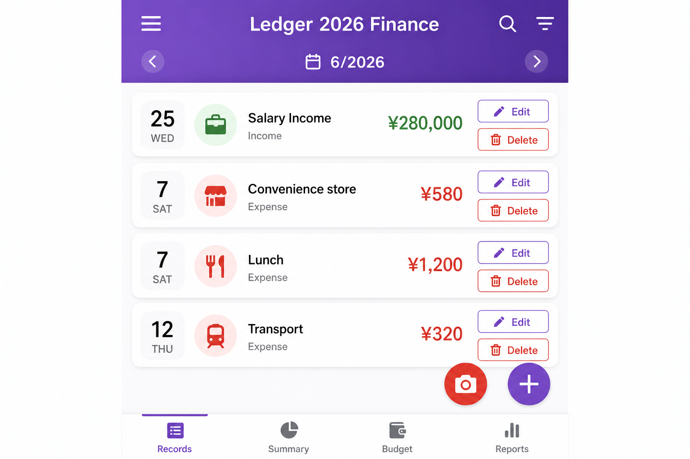
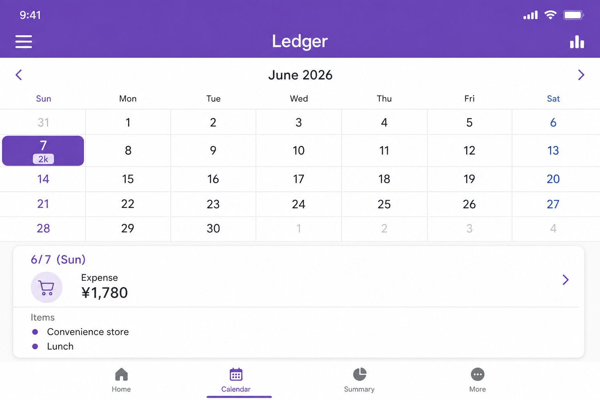
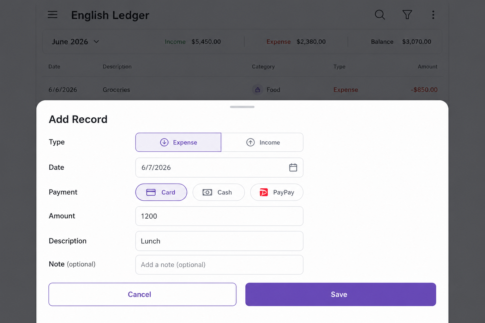
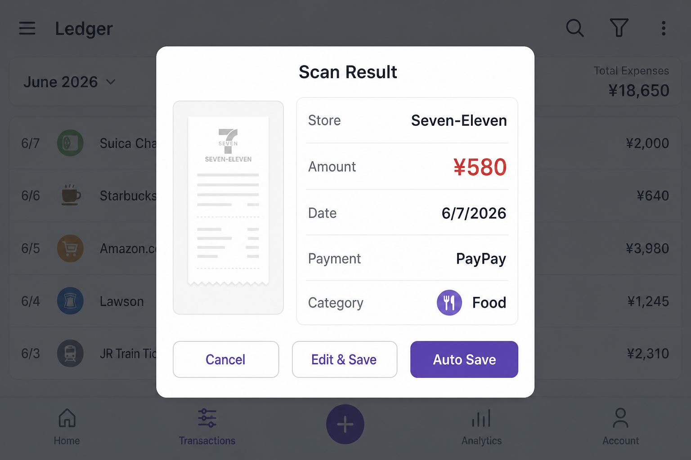
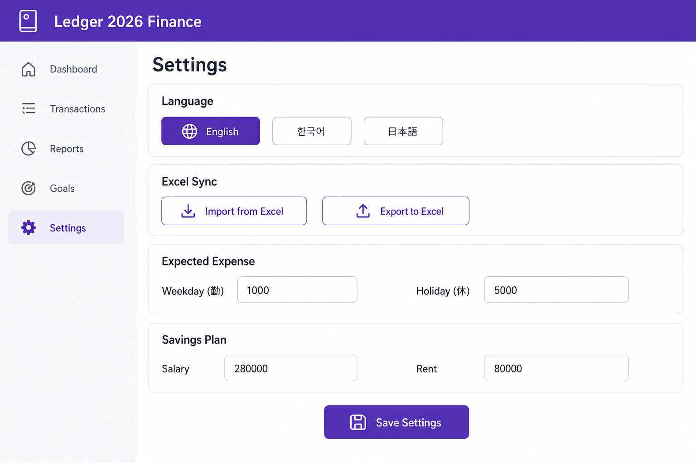

# Ledger (household-ledger)

## Application Info

| Item | Value |
|------|-------|
| **App name (English)** | Ledger |
| **App name (Korean)** | 가계부 |
| **App name (Japanese)** | 家計簿 |
| **Package name** | `com.household.ledger` |
| **Project folder** | `household-ledger` |
| **Platform** | Android (Expo + React Native) |

---

## Overview

**Ledger** is a **household income and expense management app** that brings Excel-based ledger workflows to mobile.

It is compatible with the existing `2026년달력` Excel format and provides monthly income/expense tracking, calendar-based scheduling, a monthly summary dashboard, receipt OCR auto-registration, and Excel import/export.

The app supports **한국어 · 日本語 · English**. You can switch the UI language in Settings.

**Documentation:** [README_KOR.md](README_KOR.md) (Korean) · [README_JAP.md](README_JAP.md) (Japanese)

---

## Key Features

### 1. Monthly Summary Dashboard

View **expenses, income, and balance** for the selected month at a glance. Includes a daily expense bar chart, payment method statistics, and work day (勤) / rest day (休) schedule summary.



| Feature | Description |
|---------|-------------|
| Monthly summary | Total expense, income, and balance for the month |
| Daily expense chart | Bar graph showing spending by day |
| Payment method stats | Totals by Card, PayPay, Cash, etc. |
| Schedule summary | Work days (勤) and rest days (休) count |

---

### 2. Income & Expense Records

View monthly income and expense records in a list. **Add, edit, and delete** entries. Each record includes type, payment method, amount, description, and memo.



| Feature | Description |
|---------|-------------|
| Record list | Income/expense list sorted by date |
| Add record | Tap + to add a new income or expense |
| Edit record | Tap a row or the Edit button |
| Delete record | Tap Delete to remove an entry |

**Payment methods:** Cash, Card, PayPay, Rakuten Pay, Bank Transfer

---

### 3. Calendar View

See **daily expenses** on a monthly calendar. Tap a date to view detailed records for that day. Work days (勤) and rest days (休) are visually distinguished.



| Feature | Description |
|---------|-------------|
| Monthly calendar | Daily expense amounts shown in calendar cells |
| Date selection | Tap a date to see actual expense/income and records |
| Work/rest days | Weekdays marked 勤, holidays marked 休 |
| Edit from calendar | Tap a record to open the edit screen |

---

### 4. Add / Edit Record

Form screen for registering or editing income or expenses. Enter year, month, day, type, payment method, amount, description, and memo.



| Feature | Description |
|---------|-------------|
| Type selection | Expense or Income |
| Date input | Set year, month, and day |
| Payment method | Cash, Card, PayPay, etc. |
| Amount & details | Enter amount, description, and optional memo |

---

### 5. Receipt Scan (OCR)

Take a photo with the camera or choose from the gallery. **ML Kit OCR** automatically detects amount, date, store name, and payment method. Choose auto-save or edit before saving.



| Feature | Description |
|---------|-------------|
| Camera capture | Photograph a receipt directly |
| Gallery select | Choose a saved receipt image |
| OCR recognition | Auto-extract amount, date, store, payment method |
| Auto save | Confirm and register as expense immediately |
| Edit & save | Review and modify before saving |

**Supported receipt languages:** Korean, Japanese (multi-script OCR: Korean · Japanese · Latin)

---

### 6. Settings

Manage language, Excel sync, expected expenses, savings plan, and data reset.



| Feature | Description |
|---------|-------------|
| Language | Choose 한국어 / 日本語 / English |
| Excel import | Load an existing ledger Excel file |
| Excel export | Export current data to Excel |
| Expected expense | Set weekday (勤) and holiday (休) expected amounts |
| Savings plan | Enter salary, bonus, fixed costs, rent |
| Reset data | Delete all stored data |

---

## Excel Integration

| Sheet | Description |
|-------|-------------|
| `지출기록_N월` | Monthly income/expense records |
| `2026년달력` | Calendar and expected expenses |
| `참조` | Payment methods, weekday/holiday expected expenses |
| `2026년휴일` | Public holidays |
| `2026저축계획` | Salary, fixed costs, rent, etc. |

Import and export Excel files from the **Settings** tab.

---

## Changelog

### v1.1.0 (2026-06-07)

| Category | Details |
|----------|---------|
| **Project** | Renamed folder `reactNative` → `household-ledger`, app display name **Ledger** |
| **i18n** | Korean · Japanese · English UI (switchable in Settings) |
| **Receipt OCR** | Triple OCR (Korean/Japanese/Latin), text normalization, score-based amount extraction, store & payment detection |
| **Record editing** | Edit/delete income and expenses from list and calendar |
| **Docs** | Added `README_KOR.md`, `README_JAP.md`, `README.md` with feature screenshots |
| **Cleanup** | Removed unused `web/` source |
| **APK** | `household-ledger.apk` (Release, ~104MB, Git LFS) |

**APK download**

- Repository root: `household-ledger.apk` (requires [Git LFS](https://git-lfs.github.com/))
- Build output: `android/app/build/outputs/apk/release/app-release.apk`

```bash
# Clone with LFS
git lfs install
git clone https://github.com/xiger78/household-ledger.git

# Rebuild APK
export PATH="$HOME/.nodebrew/node/v20.18.0/bin:$PATH"
export ANDROID_HOME="$HOME/Library/Android/sdk"
export JAVA_HOME="$HOME/.jdks/jdk-17.0.19+10/Contents/Home"
cd ~/work/household-ledger/android
./gradlew assembleRelease
```

### v1.0.0 (2026-06-07)

- Initial Android release based on Excel household ledger
- Monthly income/expense, calendar, dashboard, Excel import/export
- Receipt scan (ML Kit OCR), savings plan settings

---

## Installation & Development

### Prerequisites

- Node.js 18+ (recommended: v20)
- JDK 17+
- Android SDK

### Run on device / emulator

```bash
export PATH="$HOME/.nodebrew/node/v20.18.0/bin:$PATH"
export ANDROID_HOME="$HOME/Library/Android/sdk"
export JAVA_HOME="$HOME/.jdks/jdk-17.0.19+10/Contents/Home"

cd ~/work/household-ledger
npm install
npm run android
```

### Build APK

```bash
./scripts/android-build.sh          # debug APK
cd android && ./gradlew assembleRelease   # release APK
```

---

## Tech Stack

| Area | Technology |
|------|------------|
| Framework | Expo SDK 52, React Native 0.76 |
| Storage | AsyncStorage |
| Excel | xlsx |
| Receipt OCR | @react-native-ml-kit/text-recognition |
| Camera / Gallery | expo-image-picker |
| Languages | Korean / Japanese / English |
