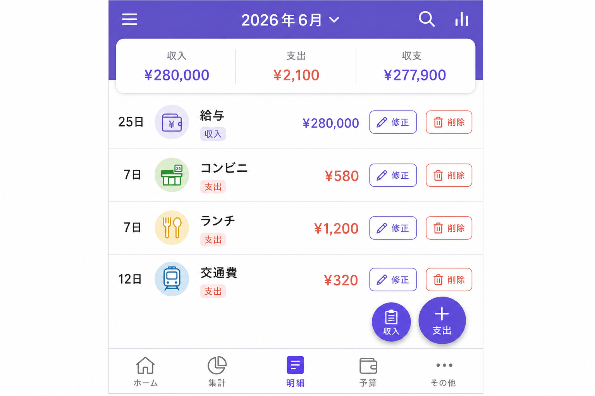
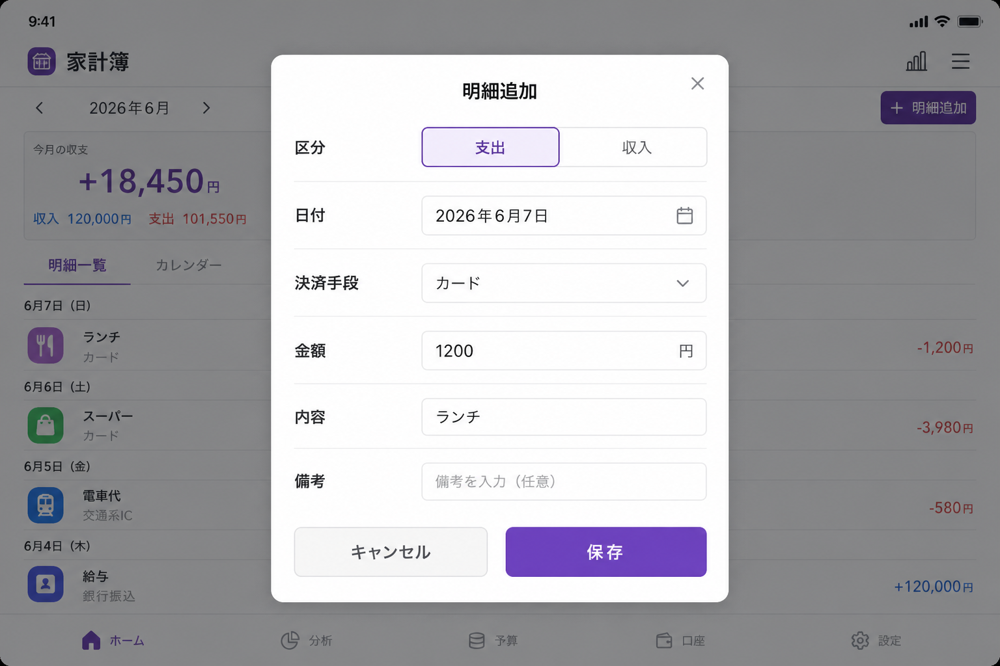

# 家計簿 (Ledger)

## プログラム名

| 項目 | 内容 |
|------|------|
| **アプリ名（日本語）** | 家計簿 |
| **アプリ名（英語）** | Ledger |
| **パッケージ名** | `com.household.ledger` |
| **プロジェクトフォルダ** | `household-ledger` |
| **プラットフォーム** | Android（Expo + React Native） |

---

## 概要

**家計簿**は、Excelベースの家計管理をモバイルアプリに移植した**家庭用の収入・支出管理アプリ**です。

既存の `2026년달력` 形式のExcelファイルと互換性があり、月別の収入・支出記録、カレンダーによる日程管理、月間サマリーダッシュボード、レシートOCR自動登録、Excelの取込・出力機能を提供します。

**한국어 · 日本語 · English** の3言語に対応しており、設定画面から表示言語を変更できます。

---

## 主な機能

### 1. 月別概要ダッシュボード

選択した月の**支出・収入・残高**を一目で確認できます。日別支出の棒グラフ、決済手段別の支出統計、出勤日（勤）・休日（休）のスケジュール概要を表示します。


| 機能 | 説明 |
|------|------|
| 月間概要 | 当月の総支出・総収入・残高を表示 |
| 日別支出チャート | 日付ごとの支出推移を棒グラフで表示 |
| 決済手段別統計 | カード、PayPay、現金など決済手段別の合計 |
| スケジュール概要 | 平日出勤日（勤）と休日（休）の日数を表示 |

---

### 2. 収入・支出明細管理

月別の収入・支出明細を一覧で確認し、**追加・修正・削除**ができます。各項目には区分、決済手段、金額、内容、備考が含まれます。



| 機能 | 説明 |
|------|------|
| 明細一覧 | 日付順の収入・支出一覧を表示 |
| 明細追加 | + ボタンで新しい収入/支出を登録 |
| 明細修正 | 項目タップまたは［修正］ボタンで編集 |
| 明細削除 | ［削除］ボタンで項目を削除 |

**決済手段：** 現金、カード、PayPay、楽天ペイ、口座振込

---

### 3. カレンダービュー

月間カレンダーで**日別の支出**を確認し、日付をタップするとその日の詳細明細を表示します。平日（勤）と休日（休）を区別して表示します。


| 機能 | 説明 |
|------|------|
| 月間カレンダー | 日別支出金額をカレンダーセルに表示 |
| 日付選択 | 日付タップで当日の実支出・実収入と明細を表示 |
| 出勤/休日表示 | 平日 勤、休日 休 を区別 |
| 明細編集 | カレンダーから項目タップで修正画面へ |

---

### 4. 明細追加・修正

収入または支出を登録・編集する入力画面です。年・月・日、区分、決済手段、金額、内容、備考を入力できます。



| 機能 | 説明 |
|------|------|
| 区分選択 | 支出 / 収入 を選択 |
| 日付入力 | 年、月、日を指定 |
| 決済手段 | 現金、カード、PayPay などを選択 |
| 金額・内容・備考 | 詳細情報を入力して保存 |

---

### 5. レシートスキャン（OCR）

カメラでレシートを撮影するか、ギャラリーから選択すると、**ML Kit OCR** が金額・日付・店名・決済手段を自動認識します。自動登録または修正して保存を選択できます。


| 機能 | 説明 |
|------|------|
| カメラ撮影 | レシートを直接撮影 |
| ギャラリー選択 | 保存済みのレシート写真を選択 |
| OCR認識 | 金額、日付、店名、決済手段を自動抽出 |
| 自動登録 | 認識結果を確認後、すぐに支出登録 |
| 修正して保存 | 認識結果を修正してから保存 |

**対応言語：** 韓国語・日本語のレシート

---

### 6. 設定

言語変更、Excel連携、予想支出設定、貯蓄計画、データ初期化を管理します。


| 機能 | 説明 |
|------|------|
| 表示言語 | 한국어 / 日本語 / English を選択 |
| Excel取込 | 既存の家計簿Excelファイルを読み込み |
| Excel出力 | 現在のデータをExcelファイルに出力 |
| 予想支出設定 | 平日（勤）・休日（休）の予想支出金額を設定 |
| 貯蓄計画 | 月給、ボーナス、固定費、家賃を入力 |
| データ初期化 | すべてのデータを削除 |

---

## Excel連携

| シート名 | 説明 |
|----------|------|
| `지출기록_N월` | 月別収入・支出明細 |
| `2026년달력` | カレンダーおよび予想支出 |
| `참조` | 決済手段、平日/休日の予想支出 |
| `2026년휴일` | 祝日情報 |
| `2026저축계획` | 月給、固定費、家賃など |

設定タブからExcelファイルの取込・出力ができます。

---

## 変更履歴

### v1.1.0 (2026-06-07)

| 区分 | 内容 |
|------|------|
| **プロジェクト** | フォルダ名 `reactNative` → `household-ledger`、アプリ表示名 **Ledger**（日本語: 家計簿） |
| **多言語** | 한국어 · 日本語 · English UI対応（設定で変更） |
| **レシートOCR** | 韓国語・日本語・ラテン3重OCR、テキスト正規化、スコアベース金額抽出、主要店舗・決済手段の自動認識 |
| **明細編集** | 一覧・カレンダーから収入/支出の修正・削除 |
| **ドキュメント** | `README_KOR.md` · `README_JAP.md` 追加（機能別画面キャプチャ付き） |
| **整理** | 未使用 `web/` ソース削除 |
| **APK** | `household-ledger.apk`（Release、約104MB） |

**APKインストールファイル**

- プロジェクトルート: `household-ledger.apk`
- ビルド出力: `android/app/build/outputs/apk/release/app-release.apk`

```bash
# APK再ビルド
export PATH="$HOME/.nodebrew/node/v20.18.0/bin:$PATH"
export ANDROID_HOME="$HOME/Library/Android/sdk"
export JAVA_HOME="$HOME/.jdks/jdk-17.0.19+10/Contents/Home"
cd ~/work/household-ledger/android
./gradlew assembleRelease
```

### v1.0.0 (2026-06-07)

- Excel家計簿ベースのAndroidアプリ初回リリース
- 月別収入/支出、カレンダー、ダッシュボード、Excel取込/出力
- レシートスキャン（ML Kit OCR）、貯蓄計画設定

---

## インストールと実行

### 必要環境

- Node.js 18+（推奨: v20）
- JDK 17+
- Android SDK

### 実行

```bash
export PATH="$HOME/.nodebrew/node/v20.18.0/bin:$PATH"
export ANDROID_HOME="$HOME/Library/Android/sdk"
export JAVA_HOME="$HOME/.jdks/jdk-17.0.19+10/Contents/Home"

cd ~/work/household-ledger
npm install
npm run android
```

### APKビルド

```bash
./scripts/android-build.sh
```

---

## 技術スタック

| 区分 | 技術 |
|------|------|
| フレームワーク | Expo SDK 52、React Native 0.76 |
| データ保存 | AsyncStorage |
| Excel処理 | xlsx |
| レシートOCR | @react-native-ml-kit/text-recognition |
| カメラ/ギャラリー | expo-image-picker |
| 多言語対応 | 한국어 / 日本語 / English |
