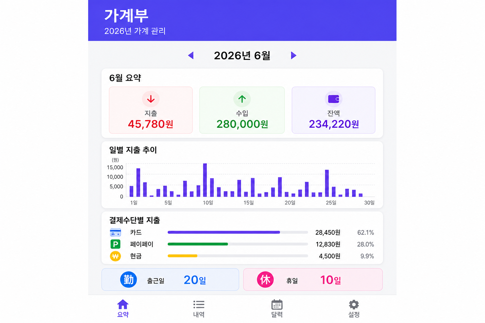
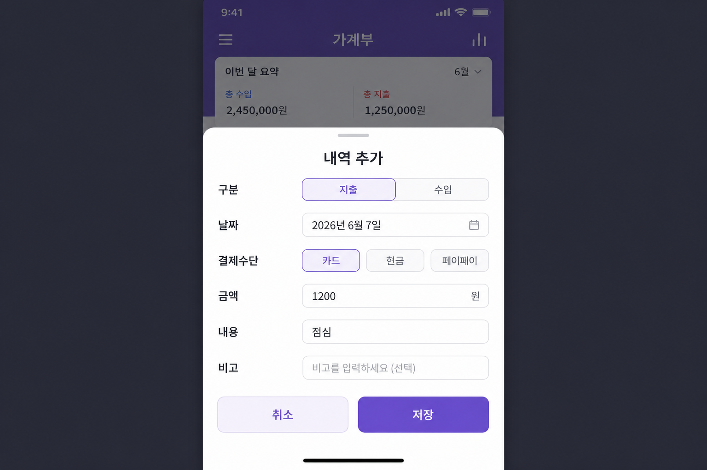
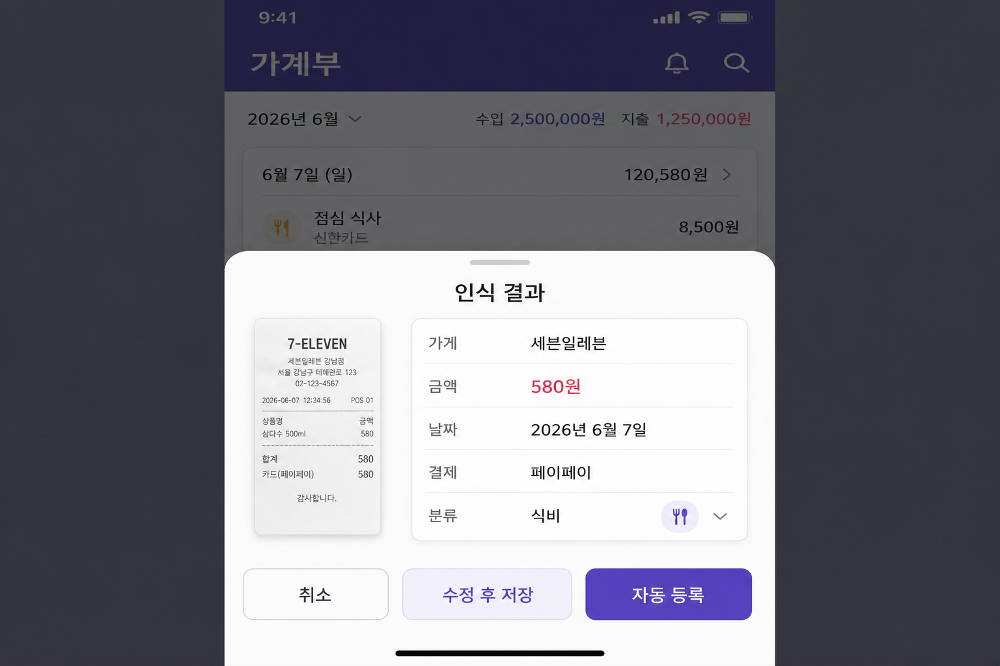

# 가계부 (Ledger)

## 프로그램명

| 항목 | 내용 |
|------|------|
| **앱 이름 (한국어)** | 가계부 |
| **앱 이름 (영어)** | Ledger |
| **패키지명** | `com.household.ledger` |
| **프로젝트 폴더** | `household-ledger` |
| **플랫폼** | Android (Expo + React Native) |

---

## 개요

**가계부**는 엑셀 기반 가계 관리 방식을 모바일 앱으로 옮긴 **가정용 수입·지출 관리 앱**입니다.

기존 `2026년달력` 형식의 엑셀 파일과 호환되며, 월별 수입·지출 기록, 달력 기반 일정 관리, 월간 요약 대시보드, 영수증 OCR 자동 등록, 엑셀 가져오기/보내기 기능을 제공합니다.

**한국어 · 日本語 · English** 세 가지 언어를 지원하며, 설정 화면에서 언어를 변경할 수 있습니다.

---

## 주요 기능

### 1. 월별 요약 대시보드

선택한 월의 **지출, 수입, 잔액**을 한눈에 확인할 수 있습니다. 일별 지출 막대 차트, 결제수단별 지출 통계, 출근일(勤)·휴일(休) 일정 요약을 제공합니다.



| 기능 | 설명 |
|------|------|
| 월간 요약 | 해당 월 총 지출·수입·잔액 표시 |
| 일별 지출 차트 | 날짜별 지출 추이를 막대 그래프로 표시 |
| 결제수단별 통계 | 카드, 페이페이, 현금 등 결제수단별 합계 |
| 일정 요약 | 평일 출근일(勤)과 휴일(休) 일수 표시 |

---

### 2. 수입·지출 내역 관리

월별 수입·지출 내역을 목록으로 확인하고, **추가·수정·삭제**할 수 있습니다. 각 항목에는 구분, 결제수단, 금액, 내용, 비고가 포함됩니다.


| 기능 | 설명 |
|------|------|
| 내역 목록 | 날짜순 수입·지출 목록 표시 |
| 내역 추가 | + 버튼으로 새 수입/지출 등록 |
| 내역 수정 | 항목 탭 또는 [수정] 버튼으로 편집 |
| 내역 삭제 | [삭제] 버튼으로 항목 제거 |

**결제수단:** 현금, 카드, 페이페이, 라쿠텐페이, 계좌이체

---

### 3. 달력 뷰

월간 달력에서 **일별 지출**을 확인하고, 날짜를 탭하면 해당 일의 상세 내역을 볼 수 있습니다. 평일(勤)과 휴일(休)을 구분하여 표시합니다.


| 기능 | 설명 |
|------|------|
| 월간 달력 | 일별 지출 금액을 달력 셀에 표시 |
| 날짜 선택 | 날짜 탭 시 해당 일의 실지출·실수입 및 내역 표시 |
| 출근/휴일 표시 | 평일 勤, 휴일 休 구분 |
| 내역 편집 | 달력에서 항목 탭 시 수정 화면 이동 |

---

### 4. 내역 추가·수정

수입 또는 지출을 등록·편집하는 입력 화면입니다. 연·월·일, 구분, 결제수단, 금액, 내용, 비고를 입력할 수 있습니다.



| 기능 | 설명 |
|------|------|
| 구분 선택 | 지출 / 수입 선택 |
| 날짜 입력 | 연, 월, 일 지정 |
| 결제수단 | 현금, 카드, 페이페이 등 선택 |
| 금액·내용·비고 | 상세 정보 입력 후 저장 |

---

### 5. 영수증 스캔 (OCR)

카메라로 영수증을 촬영하거나 갤러리에서 선택하면, **ML Kit OCR**이 금액·날짜·가게명·결제수단을 자동 인식합니다. 자동 등록 또는 수정 후 저장을 선택할 수 있습니다.



| 기능 | 설명 |
|------|------|
| 카메라 촬영 | 영수증을 직접 촬영 |
| 갤러리 선택 | 저장된 영수증 사진 선택 |
| OCR 인식 | 금액, 날짜, 가게명, 결제수단 자동 추출 |
| 자동 등록 | 인식 결과를 확인 후 바로 지출 등록 |
| 수정 후 저장 | 인식 결과를 수정한 뒤 저장 |

**지원 언어:** 한국어·일본어 영수증

---

### 6. 설정

언어 변경, 엑셀 연동, 예상 지출 설정, 저축 계획, 데이터 초기화를 관리합니다.


| 기능 | 설명 |
|------|------|
| 화면 언어 | 한국어 / 日本語 / English 선택 |
| 엑셀 가져오기 | 기존 가계부 엑셀 파일 불러오기 |
| 엑셀 보내기 | 현재 데이터를 엑셀 파일로보내기 |
| 예상 지출 설정 | 평일(勤)·휴일(休) 예상 지출 금액 설정 |
| 저축 계획 | 월급, 상여, 고정비, 월세 입력 |
| 데이터 초기화 | 모든 데이터 삭제 |

---

## 엑셀 연동

| 시트명 | 설명 |
|--------|------|
| `지출기록_N월` | 월별 수입·지출 내역 |
| `2026년달력` | 달력 및 예상 지출 |
| `참조` | 결제수단, 평일/휴일 예상 지출 |
| `2026년휴일` | 공휴일 정보 |
| `2026저축계획` | 월급, 고정비, 월세 등 |

설정 탭에서 엑셀 파일을 가져오거나 보낼 수 있습니다.

---

## 변경 이력

### v1.1.0 (2026-06-07)

| 구분 | 내용 |
|------|------|
| **프로젝트** | 폴더명 `reactNative` → `household-ledger`, 앱 표시명 **Ledger** (한국어: 가계부) |
| **다국어** | 한국어 · 日本語 · English UI 지원 (설정에서 변경) |
| **영수증 OCR** | 한국어·일본어·라틴 3중 OCR, 텍스트 정규화, 점수 기반 금액 추출, 주요 매장·결제수단 자동 인식 |
| **내역 편집** | 목록·달력에서 수입/지출 수정·삭제 |
| **문서** | `README_KOR.md` · `README_JAP.md` 추가 (기능별 화면 캡처 포함) |
| **정리** | 미사용 `web/` 소스 삭제 |
| **APK** | `household-ledger.apk` (Release, 약 104MB) |

**APK 설치 파일**

- 프로젝트 루트: `household-ledger.apk`
- 빌드 출력: `android/app/build/outputs/apk/release/app-release.apk`

```bash
# APK 재빌드
export PATH="$HOME/.nodebrew/node/v20.18.0/bin:$PATH"
export ANDROID_HOME="$HOME/Library/Android/sdk"
export JAVA_HOME="$HOME/.jdks/jdk-17.0.19+10/Contents/Home"
cd ~/work/household-ledger/android
./gradlew assembleRelease
```

### v1.0.0 (2026-06-07)

- 엑셀 가계부 기반 Android 앱 최초 릴리스
- 월별 수입/지출, 달력, 대시보드, 엑셀 가져오기/보내기
- 영수증 스캔 (ML Kit OCR), 저축 계획 설정

---

## 설치 및 실행

### 사전 요구사항

- Node.js 18+ (권장: v20)
- JDK 17+
- Android SDK

### 실행

```bash
export PATH="$HOME/.nodebrew/node/v20.18.0/bin:$PATH"
export ANDROID_HOME="$HOME/Library/Android/sdk"
export JAVA_HOME="$HOME/.jdks/jdk-17.0.19+10/Contents/Home"

cd ~/work/household-ledger
npm install
npm run android
```

### APK 빌드

```bash
./scripts/android-build.sh
```

---

## 기술 스택

| 구분 | 기술 |
|------|------|
| 프레임워크 | Expo SDK 52, React Native 0.76 |
| 데이터 저장 | AsyncStorage |
| 엑셀 처리 | xlsx |
| 영수증 OCR | @react-native-ml-kit/text-recognition |
| 카메라/갤러리 | expo-image-picker |
| 다국어 | 한국어 / 日本語 / English |
